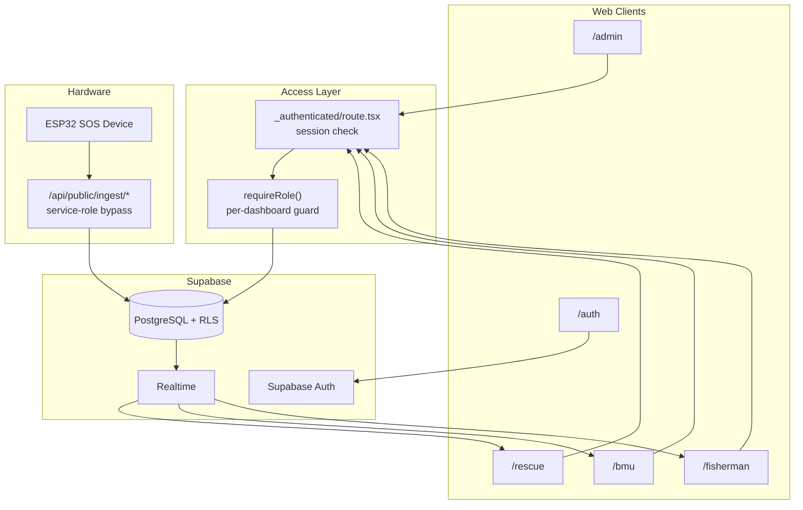
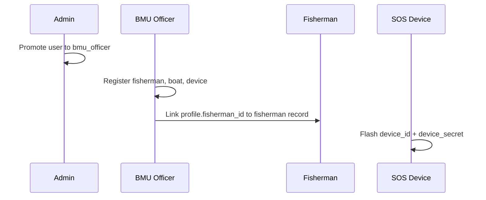
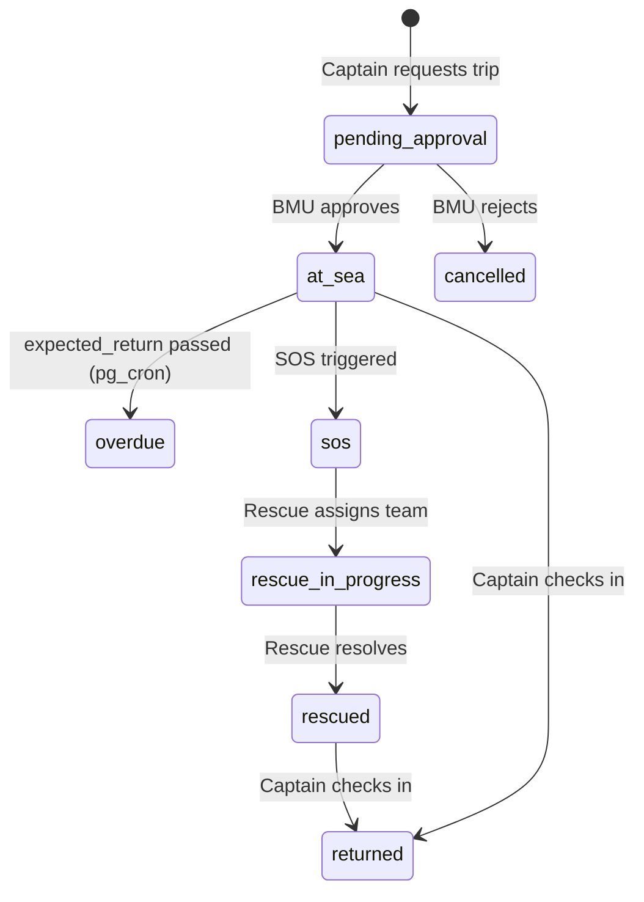
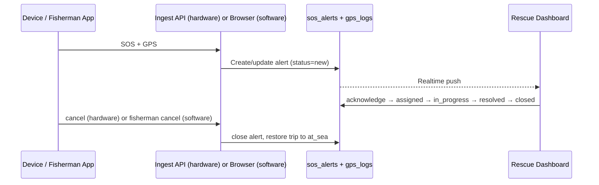
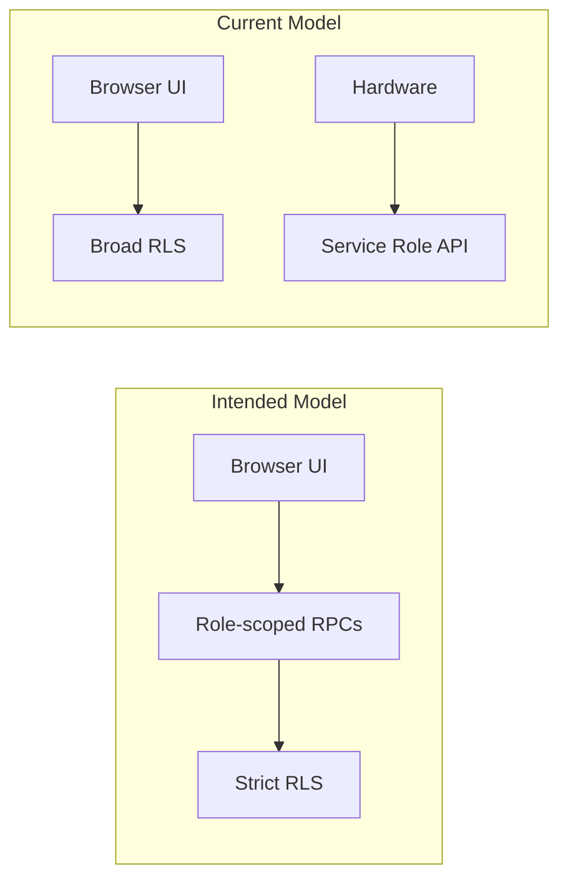

# SEAGUARD — Marine Rescue Coordination Platform

A real-time maritime operations platform connecting fishermen, Beach Management Units (BMUs), and rescue officers. Fishermen carry an SOS device at sea; one button press triggers an instant alarm on the rescue dashboard with live GPS tracking.

---

## Tech Stack

| Layer     | Technology                                       |
| --------- | ------------------------------------------------ |
| Framework | TanStack Start (React + SSR)                     |
| Routing   | TanStack Router (file-based)                     |
| Database  | Supabase (PostgreSQL + Realtime)                 |
| Auth      | Supabase Auth (email/password + Google OAuth)    |
| Styling   | Tailwind CSS v4                                  |
| Map       | Leaflet (CartoDB dark tiles — no API key needed) |
| Build     | Vite + Bun                                       |
| Deploy    | Cloudflare Workers (via Nitro)                   |

---

## Roles

| Role             | Dashboard    | Access                                                    |
| ---------------- | ------------ | --------------------------------------------------------- |
| `admin`          | `/admin`     | User & role management, fisherman account linking         |
| `bmu_officer`    | `/bmu`       | Register fishermen, boats, SOS devices; approve sea trips |
| `rescue_officer` | `/rescue`    | Live SOS incident queue, GPS map, rescue operations       |
| `fisherman`      | `/fisherman` | Sea trip check-in/out, device status, trip history        |

Every new signup defaults to `fisherman`. An admin must promote accounts to other roles via the Admin console.

---

## System Architecture



Web clients authenticate via Supabase Auth, pass through the `_authenticated` auth gate, and are routed to role-specific dashboards by `requireRole()`. Hardware devices bypass browser auth and call public ingest endpoints, which use the service-role client to write directly to the database.

---

## Operational Flows

### Onboarding



1. Admin promotes a user to `bmu_officer` (or other staff roles).
2. BMU officer registers fishermen, boats, and SOS devices in `/bmu`.
3. BMU officer links each fisherman's auth account to their fisherman record (`profiles.fisherman_id`).
4. Device credentials (`device_id`, `device_secret`) are flashed onto the hardware.

### Sea Trip Lifecycle



- Captain submits a trip request from `/fisherman` → `pending_approval`.
- BMU officer reviews and approves or rejects in `/bmu`.
- `mark_overdue_trips()` (pg_cron, every 5 min) flags `at_sea` trips past `expected_return` as `overdue`.
- Captain checks in on return → `returned`.

### SOS & Rescue



**Hardware path:** `/api/public/ingest/sos`, `location`, `cancel` — authenticated via `x-device-secret`, uses the service-role client (bypasses RLS).

**Software path:** Fisherman portal inserts directly into `sos_alerts` and `gps_logs` from the browser.

Alert status transitions: `new` → `acknowledged` → `assigned` → `in_progress` → `resolved` → `closed`.

---

## Access Control

### Applied Today

| Layer | Mechanism | What it enforces |
| ----- | --------- | ---------------- |
| Auth gate | `_authenticated/route.tsx` | Unauthenticated users → `/auth` |
| Role routing | `requireRole()` + `ROLE_HOME` | Each dashboard only loads for its role; wrong role redirected home |
| Role priority | `pickPrimary()` in `use-role.ts` | Multi-role users: `admin` > `rescue_officer` > `bmu_officer` > `fisherman` |
| Hardware ingest | `x-device-secret` header | Timing-safe secret compare; inactive devices rejected |
| Fisherman link | `chk_fisherman_link_staff` CHECK | Staff accounts cannot be linked to fisherman records |

### Intended Model (in progress)

Role-aware RLS, BMU officer scoping, server-side RPCs for sensitive writes, and hardware hardening are tracked in **[DASHBOARD_FIX_TODO.md](./DASHBOARD_FIX_TODO.md)**.



| Role | Intended access |
| ---- | --------------- |
| `fisherman` | Own linked records, trips (captain or crew), own alerts |
| `bmu_officer` | Only assigned BMU(s): fishermen, boats, devices, trip approvals |
| `rescue_officer` | Read active SOS/rescue data; no admin/BMU management |
| `admin` | User/role management via controlled RPCs only |

---

## Project Structure

```
src/
├── routes/
│   ├── __root.tsx                  # App shell
│   ├── index.tsx                   # Redirects to /auth or role dashboard
│   ├── auth.tsx                    # Login / signup page
│   └── _authenticated/
│       ├── route.tsx               # Auth gate + role resolver
│       ├── admin.tsx               # Admin dashboard
│       ├── bmu.tsx                 # BMU console
│       ├── rescue.tsx              # Rescue operations center
│       └── fisherman.tsx           # Fisherman portal
│   └── api/public/ingest/
│       ├── sos.ts                  # Hardware SOS trigger endpoint
│       ├── location.ts             # Continuous GPS update endpoint
│       └── cancel.ts               # SOS cancel endpoint
├── lib/
│   ├── use-role.ts                 # Role types, ROLE_HOME, helpers
│   ├── route-guard.ts              # requireRole() for beforeLoad
│   ├── marine-types.ts             # Shared domain types
│   └── utils.ts                   # cn() tailwind helper
├── integrations/
│   ├── supabase/
│   │   ├── client.ts               # Browser Supabase client
│   │   ├── client.server.ts        # Server-side admin client (service role)
│   │   ├── auth-attacher.ts        # Attaches bearer token to serverFn calls
│   │   ├── auth-middleware.ts      # requireSupabaseAuth middleware
│   │   └── types.ts                # Generated DB types
│   └── lovable/
│       └── index.ts                # Lovable OAuth helper
├── assets/
│   └── sos-alarm.mp3.asset.json    # SOS alarm audio URL
├── server.ts                       # SSR server entry with error handling
├── start.ts                        # TanStack Start config + middleware
├── router.tsx                      # Router factory
├── routeTree.gen.ts                # Auto-generated — do not edit
└── styles.css                      # Global Tailwind styles

supabase/
└── migrations/                     # All DB migrations in order
```

---

## Environment Variables

Copy `.env` and fill in your values. Never commit the service role key.

```env
# Client-side (Vite injects these at build time)
VITE_SUPABASE_URL=https://yourproject.supabase.co
VITE_SUPABASE_PUBLISHABLE_KEY=sb_publishable_...

# Server-side (SSR + ingest endpoints)
SUPABASE_URL=https://yourproject.supabase.co
SUPABASE_PUBLISHABLE_KEY=sb_publishable_...

# Required for hardware ingest endpoints — NEVER expose to client
# Get from: Supabase Dashboard → Project Settings → API → service_role
SUPABASE_SERVICE_ROLE_KEY=eyJ...
```

---

## Getting Started

```bash
# Install dependencies
bun install

# Run dev server
bun run dev

# Build for production
bun run build

# Push DB migrations
supabase db push

# Generate fresh TypeScript types after schema changes
supabase gen types typescript --project-id <ref> > src/integrations/supabase/types.ts
```

### First-time admin setup

After the first user signs up, promote them to admin directly in Supabase SQL Editor:

```sql
INSERT INTO public.user_roles (user_id, role)
SELECT id, 'admin'
FROM   auth.users
WHERE  email = 'your-admin@example.com'
ON CONFLICT DO NOTHING;
```

Then log in and use the Admin console to assign roles to everyone else.

---

## Database Migrations

| File             | Description                                                                  |
| ---------------- | ---------------------------------------------------------------------------- |
| `20260625...`    | Initial schema: profiles, roles, devices, alerts, GPS logs, notifications    |
| `20260701...`    | Add `device_secret` column, remove public device read policy                 |
| `20260702...`    | Add `battery` and `emergency_level` columns to alerts + GPS logs             |
| `20260703...`    | Add `rescue_officer` + `fisherman` roles, sea trips, trip crew, trip history |
| `20260705...`    | Overdue trip auto-detection (pg_cron), realtime publication extensions       |
| `20260706000000` | Add `rescue_officer` enum value                                              |
| `20260706000001` | Migrate old roles, add fisherman-link constraint                             |

---

## Routing Conventions

TanStack Start uses **file-based routing**. Every `.tsx` in `src/routes/` is a route.

| File                            | URL                              |
| ------------------------------- | -------------------------------- |
| `index.tsx`                     | `/` → redirects based on session |
| `auth.tsx`                      | `/auth`                          |
| `_authenticated/admin.tsx`      | `/admin`                         |
| `_authenticated/bmu.tsx`        | `/bmu`                           |
| `_authenticated/rescue.tsx`     | `/rescue`                        |
| `_authenticated/fisherman.tsx`  | `/fisherman`                     |
| `api/public/ingest/sos.ts`      | `/api/public/ingest/sos`         |
| `api/public/ingest/location.ts` | `/api/public/ingest/location`    |
| `api/public/ingest/cancel.ts`   | `/api/public/ingest/cancel`      |

`routeTree.gen.ts` is auto-generated by TanStack Router. Do not edit it.

---

## Hardware Integration

See **[HARDWARE_INTEGRATION.md](./HARDWARE_INTEGRATION.md)** for the complete firmware integration guide including all endpoint payloads, authentication, and example ESP32 code.
