# The Silent SOS — Root-Cause Report

**SeaGuard · 12 August 2026 · Rev 1**

A fisherman presses the distress button and nothing reaches the rescue dashboard. The
alert was never created, never transmitted, and never logged — the request died inside
the modem, four layers before anything the dashboard could show.

| | |
| --- | --- |
| **Root cause** | Modem HTTP session leak |
| **Defects fixed** | 12 |
| **Tests** | 75 passing (39 ingest, 36 firmware) |
| **Status** | Complete in software; hardware verification pending |

---

## 1. What was reported

Pressing the physical SOS button produced no incident on the rescue dashboard. The
obvious readings — a broken realtime subscription, an RLS policy hiding the row, a
dashboard render bug — were all wrong. Tracing the path backwards from the dashboard,
every stage was clean until the modem.

The alert was never inserted, because the request never arrived, because the firmware
never opened a connection. The device reported the failure only to its own serial
console, which nobody is watching at sea.

---

## 2. Root cause

> **The defect.** The firmware never issued `AT+HTTPTERM`. The SIM800L permits exactly
> one HTTP session, so every request after the first was refused at `AT+HTTPINIT` and
> abandoned before a byte went out.

The sequencing is what made this total rather than intermittent. Fifteen seconds after
boot the firmware sends its first routine location ping. That ping opens the device's
only HTTP session and never closes it. From that moment the radio is, for practical
purposes, dead — and an SOS pressed at any point in a normal fishing trip falls inside
that window.

Only an SOS pressed within the first fifteen seconds of uptime could ever have been
transmitted. That is why the fault looked absolute in the field and was hard to
reproduce on a bench, where devices are power-cycled constantly.

```mermaid
flowchart TB
    subgraph before["BEFORE — the session is never released"]
        direction LR
        B1["t+15s · /location<br/>AT+HTTPINIT ✓"] --> B2["AT+HTTPACTION"]
        B2 --> B3(["no AT+HTTPTERM"])
        B3 -. "session held open" .-> B4["t+42s · /sos<br/>AT+HTTPINIT"]
        B4 --> B5["ERROR — aborted,<br/>nothing transmitted"]
    end

    subgraph after["AFTER — every transaction is bracketed"]
        direction LR
        A1["AT+HTTPTERM"] --> A2["AT+HTTPINIT ✓"]
        A2 --> A3["AT+HTTPACTION"]
        A3 --> A4(["AT+HTTPTERM<br/>on success and<br/>every failure path"])
        A4 -. "session free for<br/>the next request" .-> A1
    end

    classDef bad stroke:#b23b32,stroke-width:2px
    classDef good stroke:#2c7350,stroke-width:2px
    class B3,B4,B5 bad
    class A4 good
```



**Figure 1** — One missing command. With no `HTTPTERM`, the routine location ping at
t+15s holds the modem's only HTTP session, and the SOS twenty-seven seconds later is
refused at `HTTPINIT` before any network traffic occurs. The fix brackets every
transaction, so a failure mid-sequence cannot strand the session either.

---

## 3. Four independent breaks

The session leak was not the only thing wrong on that path. Three further firmware
defects were each, on their own, sufficient to lose a distress call. Fixing any one of
them would not have restored the feature — worth stating plainly, because a partial fix
here reads as success on the bench and still fails at sea.

| Defect | Effect | Status |
| --- | --- | --- |
| **Session never terminated** | Every request after the first is refused by the modem | Fixed |
| **Response parsed by exact match** | The modem returns `+HTTPACTION: 1,200,52` with a space; the code matched a string without one, so a delivered SOS read as a failure | Fixed |
| **Long press always cancelled** | Holding the button past 1.5 s sent `/cancel` in any state — gripping it in a panic cancelled instead of alerting | Fixed |
| **No retry** | A failed send returned to idle and the SOS was discarded silently | Fixed |
| **Roaming rejected** | `AT+CREG?` accepted only `0,1`, so a device attached to a partner network read as unregistered | Fixed |
| **Fabricated telemetry** | Battery hardcoded to `80`; a no-fix GPS sent as `0,0`, placing the vessel off West Africa | Fixed |

### Button semantics

The cancel gesture needed a decision, not just a longer timer. The documented behaviour
and the shipped behaviour disagreed, and both were wrong for the situation this device
exists to handle.

| | Was | Now |
| --- | --- | --- |
| **Short press** | SOS at `LOW`, always — the level was hardcoded | SOS at `LOW`, transmitted immediately |
| **Second press** | Nothing; the documented double-press for `HIGH` did not exist in the firmware | Escalates the open incident to `HIGH` |
| **Long press** | Cancel after 1.5 s, in any state | Cancel after 3 s, and only when an SOS is open |

Escalation is a second press rather than a double-click inside a window, deliberately:
an emergency signal is never held back to disambiguate a gesture. The first press goes
out at once, and the server treats the repeat as an update to the open incident rather
than a new one.

---

## 4. The rest of the path

With the modem fixed, the request reaches an API that had its own ways of losing an
emergency. Three near-identical route files had drifted apart, and the divergences were
precisely where they mattered.


| Stage | Verdict |
| --- | --- |
| Button | Inspected, no defect found |
| **Firmware** | 4 defects — lost the distress call |
| **SIM800L** | 2 defects — lost the distress call |
| HTTPS | Inspected, no defect found |
| **Ingest API** | 4 defects — lost the distress call |
| **Postgres** | 3 security findings; alerts were still delivered |
| Realtime | Inspected, no defect found |
| Dashboard | Inspected, no defect found |

**Figure 2** — Where the defects actually were. The dashboard, the reported symptom, was
the one stage with nothing wrong with it: its realtime subscription, RLS scoping and
incident rendering all check out. Every defect capable of losing an alert sat upstream of
the thing being blamed.

### The API told the device to give up

Every failure in the ingest routes returned **HTTP 400**, database outages included. The
firmware's own contract defines 4xx as permanent and 5xx as retryable, so a transient
Postgres blip instructed the device to discard an emergency forever. Storage failures now
return `503`.

The open-alert lookup used `.maybeSingle()`, which errors when a device has more than one
open alert — a state the in-app SOS path can produce. That error was destructured away,
so the handler read "no open alert" and inserted another one. Every press compounded the
duplicates.

Both were fixed by collapsing the three routes onto one shared handler
(`src/lib/ingest-core.ts`). The route files went from 447 lines of triplicated, drifting
logic to roughly twenty lines each; authentication, status codes, idempotency and logging
now have exactly one implementation and cannot diverge again.

### An SOS without a position is still an SOS

The schema required `lat` and `lng`, so a device with no GPS fix had to send something. It
sent `0,0`, which validated cleanly and dropped the rescue marker in the Gulf of Guinea.
Coordinates are now optional on `/sos`, `0,0` is rejected as "no fix", and the incident is
raised immediately with the position following on the next ping. A distress call is never
dropped for want of a satellite.

---

## 5. Security findings

The audit surfaced problems independent of the reported fault. The device credential
model was the weak point: secrets were predictable, stored in cleartext, and readable by
roles with no reason to see them.

| Severity | Finding | Risk | Status |
| --- | --- | --- | --- |
| High | **Live device secret committed to the repository** | Anyone with repository access can forge that device's alerts, or cancel its genuine ones | **Rotate now** |
| High | **Secrets generated with `md5(random())`** | Postgres `random()` is a seeded PRNG — the secrets are predictable, not merely short | Fixed |
| High | **Rescue officers could read every device secret** | The `devices` read policy returned the secret column to admin, BMU *and* rescue sessions | Fixed |
| High | **Secrets stored in cleartext** | One database read discloses the entire fleet | Fixed |
| Medium | **Raw exception text returned to unauthenticated callers** | Leaks schema and internal structure | Fixed |
| Medium | **Different 401s for unknown device and bad secret** | Permits device-ID enumeration | Fixed |
| Medium | **Rate limiter keyed on an unauthenticated device ID** | Knowing a device label was enough to exhaust its budget and suppress its next SOS | Fixed |
| Low | **Replay-protection helpers never called** | The appearance of a control rather than a control — nothing referenced them | Removed |
| Medium | **Rate limiter is per serverless instance** | Bounds a single connection; no defence against a distributed flood | Open |

Secrets are now SHA-256 at rest, generated from `gen_random_bytes(32)`, revoked from
browser sessions at the column level, and shown exactly once — at provisioning or at
rotation. The deployed fleet was migrated by backfilling digests from the stored
cleartext, so no device in the field needed re-flashing. See
`supabase/migrations/20260812000000_hardware_ingest_security.sql`.

> **Action required.** The secret for `DEV-9WK7LO` is in the git history, which cannot be
> rewritten (the Lovable sync described in `AGENTS.md` forbids it). Rotate it from the BMU
> console and re-flash the device. Until that happens, that device's alerts can be forged
> and its genuine ones cancelled.

---

## 6. Verification

The test suite could not run at all before this work: there was no test script and no
runner, so the four existing suites had never been executed once. Two of them asserted
behaviour the code had never had.

| Claim | How it is established |
| --- | --- |
| The ingest contract holds | 39 automated tests covering the full failure matrix: missing and invalid secrets, disabled devices on all three endpoints, every out-of-range field, storage failure returning 503, error-detail leakage, duplicate SOS, replayed event ID, and cancel after rescue engagement |
| Modem responses parse correctly | 36 checks compiled and run natively against the real firmware parsing code, including the exact `+HTTPACTION` byte sequence that caused the failure |
| Build and types are sound | Clean typecheck; production build succeeds; the service-role key is confirmed absent from the client bundle |
| The dashboard path is correct | Code inspection only — the realtime publication, RLS policies and subscription cleanup all read correctly, but no live Supabase instance was available |
| Radio, TLS and GPS work | **Not established.** Requires the physical device |

```bash
npm test              # 39 ingest tests + 36 firmware checks
npm run typecheck
npm run build
node simulate.mjs check   # device → API → database, against a running server
```

Lint sits at 364 problems, down from 437. The remainder is pre-existing formatting in
untouched dashboard files; reformatting them would have buried this change set in noise,
and belongs in a commit of its own.

---

## 7. What is not proven

This work has not touched hardware. Nothing here demonstrates that the device transmits
over a real cellular network, and it would be wrong to read the passing tests as evidence
that it does.

**The likeliest remaining blocker is TLS.** SIM800L modules shipped with older firmware
negotiate only TLS 1.0, which the deployment host will refuse. From the outside that
failure looks identical to the one just fixed — the alert simply does not arrive — so it
should be checked before anything else. If `AT+HTTPSSL=1` succeeds but `AT+HTTPACTION`
returns a 6xx code, the modem firmware is the problem.

### Known software limits

- **The AT layer blocks.** A stalled radio holds the main loop for up to thirty seconds,
  during which the button is not polled. A press made mid-stall is missed and must be
  repeated. Making the modem driver non-blocking is the largest remaining firmware
  improvement, and is a rewrite rather than a fix.
- **A pending SOS lives in RAM.** If the device loses power before the server confirms the
  alert, it is gone. Surviving power loss means writing the event to flash before the
  first transmission attempt.
- **The in-app cancel path still cancels silently.** The hardware path now notifies rescue
  officers when a cancel arrives after they have been dispatched; the in-app path does
  not yet.
- **BMU officers are not scoped to their own BMU.** No assignment model exists, so every
  officer sees every BMU's data.

---

## 8. Next

In priority order. The first two come before any field deployment:

1. Rotate the exposed secret for `DEV-9WK7LO` and re-flash the device
2. Verify SIM800L TLS against the deployment host on real hardware
3. Rebuild the AT layer as a non-blocking state machine
4. Persist pending SOS events to flash so they survive power loss
5. Move rate limiting to a shared store, then drop the cleartext secret column

---

**Status — complete in software, unverified in hardware.** The distress path is correct
and tested from the button state machine through to the database. The modem, TLS and
realtime-delivery legs rest on code inspection and simulation. This is not yet
demonstrated production-ready, and should not be described as such until a device has been
put on a boat.

The field diagnostic procedure for a device that appears silent is in
[HARDWARE_INTEGRATION.md](./HARDWARE_INTEGRATION.md). Outstanding work is tracked in
[DASHBOARD_FIX_TODO.md](./DASHBOARD_FIX_TODO.md).
